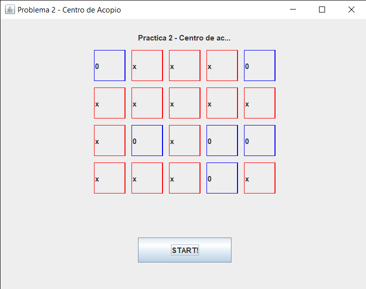
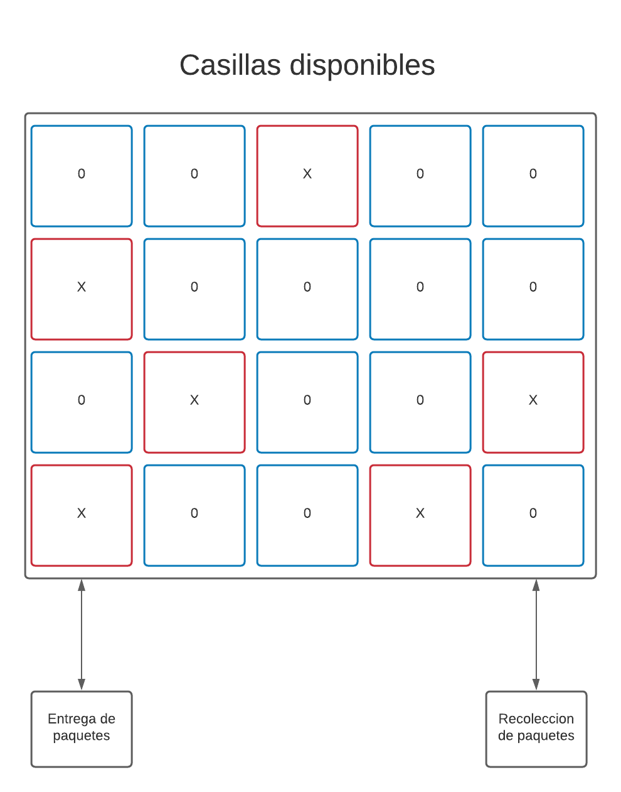

# Problema 2 - Centro de acopio

## Descripcion del problema 

Se tiene un centro en el cual se reciben y se entregan cajas con productos, el centro tiene
una estantería con una capacidad máxima de 20 cajas. Existen dos puertas grandes: una
para las personas que llegan a dejar su respectiva caja (cada persona lleva solamente 1
caja) y la otra para las que llegan a retirar (cada persona puede retirar solamente 1 caja).

Para la solución de este problema se lleva el control de los clientes que ingresan a entregar y a recoger paquetes, el estado de la estanteria con las casillas, actualizacion del limite de espacios vacios y los hilos son los encargados de estar consultando el estado de cada casilla (llena o vacia) y si todos los espacios estan llenos o no.

## Partes donde hay múltiples procesos

* Al llegar un cliente con un paquete para entregar, se verifica si en la casilla en la cual lo va a entregar esta vacia, de lo contrario tendra que esperar a que otro cliente llegue a recojer el paquete de esa casilla para poder realizar su entrega.

## ¿Cómo se realizó?

Por medio de motodos Synchronized y haciendo uso de los metodos wait() y notify() que nos provee el lenguaje en cuanto a hilos de ejecucion de procesos, se coordinaron los hilos para que estos pudieran sincronizarse de la manera correcta. 

El codigo utilizado para la solucion se presenta a continuacion:

### Metodo encargado de entregar un paquete

```

    public void entregar() throws InterruptedException{
        while (true) { 
            synchronized (this) 
            { 
                if(max<20){
                    Random r = new Random();
                    int random_number = r.nextInt(20);
                    System.out.println("numero random entregar: "+random_number);
                    if(lockers[random_number].getText().equals("0")){
                        System.out.println("<Acción> Entrega en casilla:" + (random_number));
                        lockers[random_number].setText("x");
                        lockers[random_number].setBorder(BorderFactory.createLineBorder(Color.red));
                        max++;
   
                        Thread.sleep(200);

                    }else{
                        System.out.println("<Accion> Casilla "+(random_number)+ " ocupada");
                        Thread.sleep(200);
                         wait();
                     }
  
                }   
            }
  
        }
    } 

```

#### Descripcion del metodo entregar()

El metodo que entrega las cajas, evalua la condicion de la cantidad de espacios disponibles. Para darle aleatoriedad a la simulacion, se otorgo un numero random de casilla que es la que usara el ciente para colocar su pedido, el numero tiene un rango entre 0-19, los cuales corresponden a su similar en las casillas, se evalua el estado de la casilla, si esta casilla se encuentra llena se manda a llamar el metodo wait() para que el hilo espere ya que debe de esperar a que otro cliente recoja la caja, de lo contrario se almacena la caja.

### Metodo encargado de recoger el paquete

    public void recoger() throws InterruptedException{
        while (true) { 
            synchronized (this) 
            { 
                if(max >= 0){
                    Random r = new Random();
                    int random_number = r.nextInt(19);
                    System.out.println("numero random recoger: "+random_number);
                    if(lockers[random_number].getText().equals("x")){
                        System.out.println("<Acción> Entrega en casilla:" + (random_number));
                        lockers[random_number].setText("0");
                        lockers[random_number].setBorder(BorderFactory.createLineBorder(Color.blue));
                        max--;
                        Thread.sleep(200);
                    }else{
                        System.out.println("<Accion> Casilla "+(random_number)+ " vacia");
                        Thread.sleep(200);
                    }  
                } 
          
          
            }
      
        }
  
}
#### Descripcion del metodo recoger()

El meotodo recoger evalua si existen casillas disponibles para recolectar cajas, luego recibe el numero aleatorio otorgado de manera random el cual viene dado en el rango 0-19 correspondiente a su similar en las casillas, la cual evalua si la casilla dada esta ocupada recoge el paquete en ella y si no, sigue con su camino y es notoficado con el metodo notify();

## Situaciones riesgosas

Debido a la taza de llegada de clientes que entregan paquetes que corresponde a un 70%, mientras que un 30% para los clientes que llegan a recoger, puede llegar a desbordar en algun momento la estanteria, entonces para este caso se utiliza la propiedad synchronized en los metodos para asi evitar este tipo de percanses. 

## Variables o datos que era necesario compartir entre procesos.

* Estado del la estanteria
* Numero de casilla

## Imagenes

Interfaz grafica que representa las casillas dentro del software de simulacion



Representacion de la logistica de como ingresan las entregas y las recolecciones 


