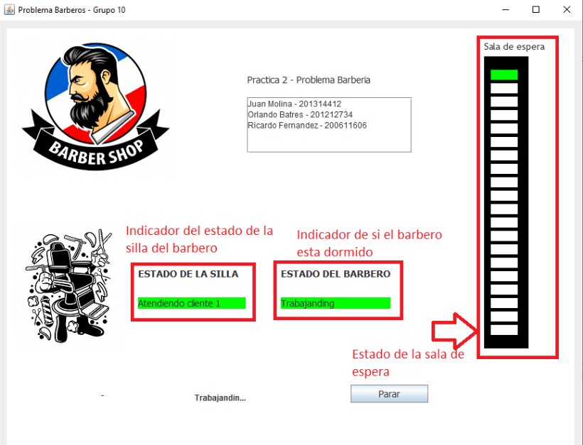

# Problema 3 - Barbero

Para la solución de este problema se lleva el control de los clientes, el estado del barbero y la sala de espera. Cada clase lleva un hilo en el cual se puede controlar parámetros como si el barbero está durmiendo, cuántas sillas hay disponibles y el tiempo de llegada de un cliente.

## Partes donde hay múltiples procesos

* Al llegar un cliente se verifica sobre el proceso del control de sillas y el proceso del control del barbero tanto para verificar si debe tomar asiento para esperar, si pasa de una vez con el barbero o si está llena la barbería.

## ¿Cómo se realizó?

A la barbería llegan los clientes con una tasa de llegada que puede ser parametrizada por medio del “thread.sleep(n)”, cada cliente implementa de la clase “runnable” y dentro de su método “run” verifica el estado del barbero el cual a su vez maneja el estado de la sala de espera todo esto se maneja de forma sincronizada por medio de la clase “synchronized” para evitar interferencia y errores de memoria entre hilos que se estén ejecutando de forma simultánea.

## Situaciones riesgosas

Cuando colocamos una taza de llegada o de servicio muy alta es posible que haya ocurra una inconsistencia y provoque un error, para evitar que existieran los deadlocks o condiciones de carrera se implementó la clase mencionada anteriormente “synchronized” con esto evitamos posibles errores que se pudieran dar mas que todo al inicializar el hilo de un cliente nuevo el cual es quien se encarga de sincronizar las demás validaciones.

## Variables o datos que era necesario compartir entre procesos.

* Estado del barbero
* Estado de las sillas
* Etiquetas de texto para indicar en la interfaz gráfica

## Imagenes

